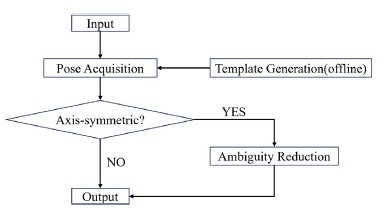
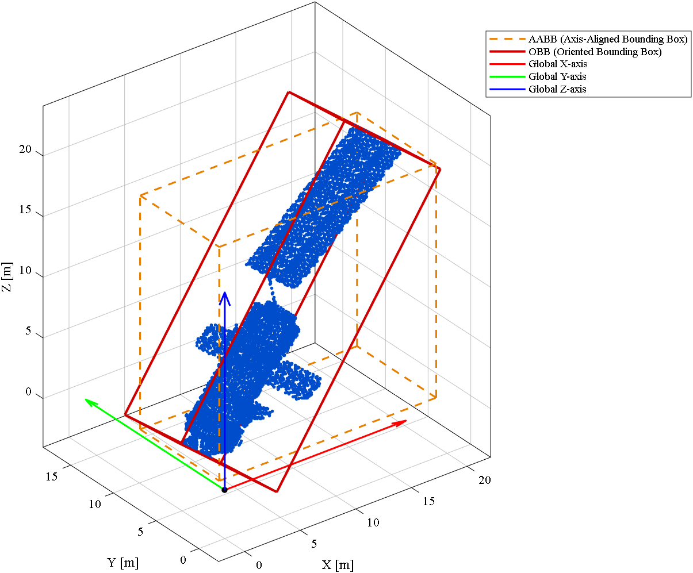
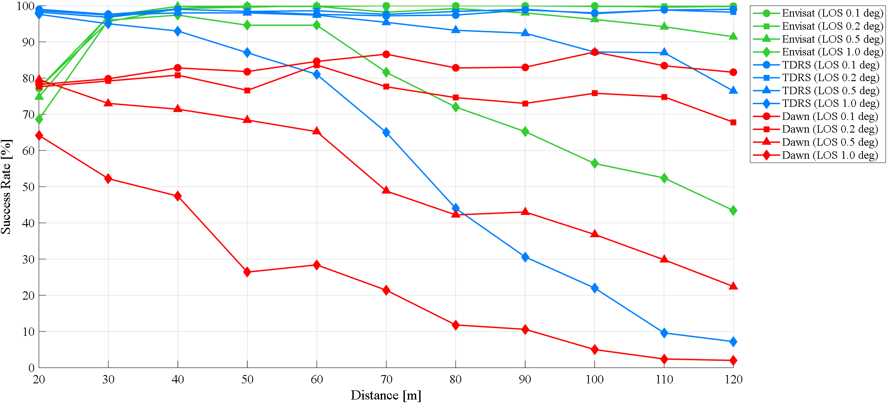

# msc-thesis-obb-tm-lidar-pose-acquisition

# LiDAR-based Pose Acquisition for Non-Cooperative Space Targets (OBB-TM)

## Overview
This repository documents my MSc thesis work on **pose acquisition (lost-in-space)** of **non-cooperative spacecraft**
from **LiDAR point clouds**, focusing on the implementation and performance analysis of the **OBB-TM** pipeline:
**PCA-based alignment → 1-DOF Template Matching → ICP refinement**, with an optional **Ambiguity Reduction** module.

Thesis title: *Performance Analysis of the OBB-TM Algorithm for LIDAR-based Pose Estimation of Non-Cooperative Space Targets*.

## Problem
Relative pose estimation is a key enabler for **On-Orbit Servicing (OOS)** and **Active Debris Removal (ADR)**,
especially when targets are **non-cooperative** (no markers / no comm link).
Main challenges addressed:
- sparse point clouds at long range
- partial views / centroid bias
- symmetry-induced pose ambiguities
- onboard computational constraints

## Method (OBB-TM)
High-level pipeline:
1) **Offline**: build a **1-DOF template database** by rotating the CAD model around the principal axis extracted via PCA
2) **Online**: PCA alignment (canonical frame) + centroid correction (partial view)
3) **Template Matching**: select best template via ICP residual
4) **Fine refinement**: ICP on full cloud
5) **Ambiguity Reduction (optional)**: evaluate 180° symmetric hypothesis and choose the lowest residual

_Angular_Resolution0_5.png)

## Simulation campaign
- Distances: **20–120 m**
- Angular resolutions: **0.1°, 0.2°, 0.5°, 1.0°**
- Targets: **Envisat (asymmetric), TDRS (Y-axis symmetric), Dawn (X-axis symmetric)**
- Success criteria: **translation error < 0.2 m** AND **attitude error < 5°**

## Key results (high level)
- Envisat: near-saturation performance at fine resolutions; close-range anomaly due to FOV/occlusion effects
- TDRS: high baseline SR; Ambiguity Reduction provides measurable gains in mid/low resolution regimes
- Dawn: SR ceiling due to geometry + sparsity; AR improvements are marginal

 
_Angular_Resolution0_5.png)

## Documents
- **2-page abstract**: - 📄 [2-page Technical Abstract](docs/Thesis_Abstract_2p.pdf)
- **Slides**: - 📄 [Power Point Presentation](docs/Presentation.pdf)
- (Optional) **Technical Summary (10–20 pages)**: `docs/Thesis_Technical_Summary.pdf`

## Keywords
Non-Cooperative Pose Estimation · LiDAR Point Cloud Registration · PCA · Template Matching · ICP · Ambiguity Reduction
